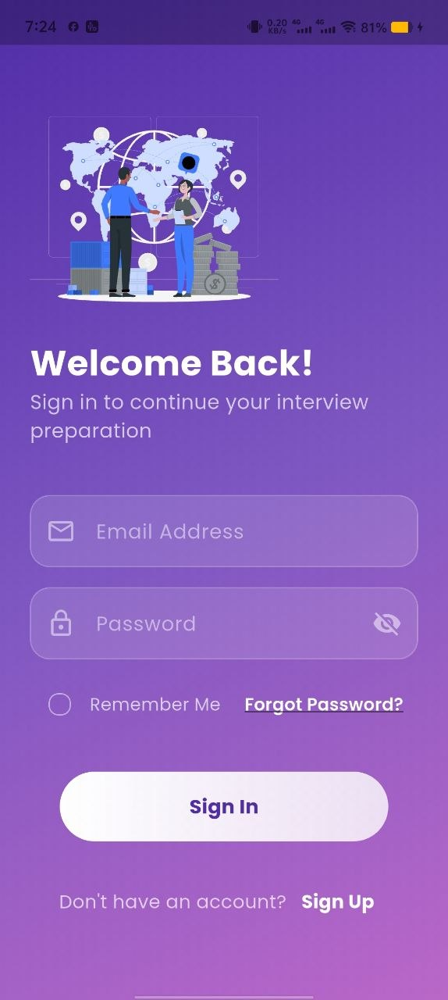
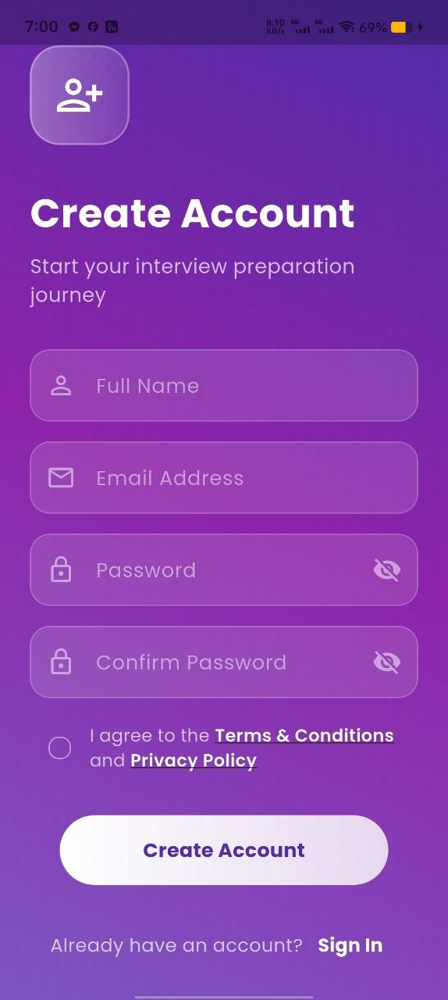
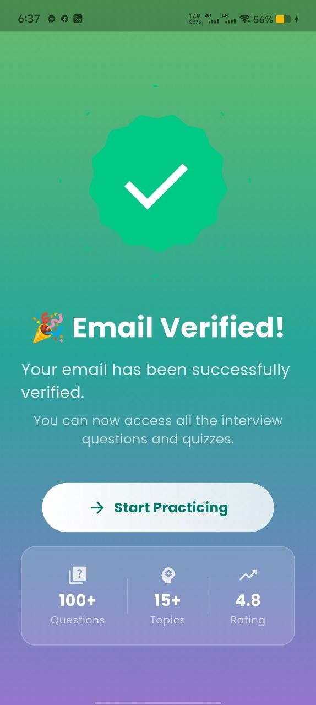
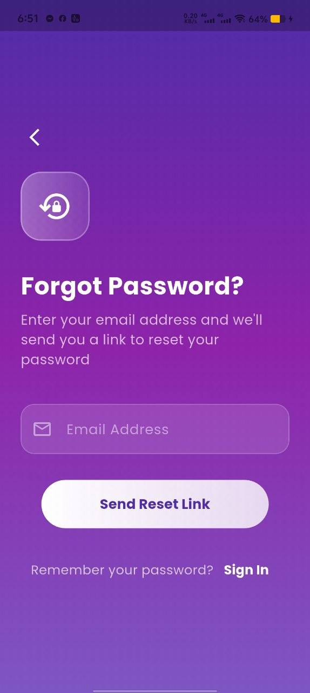
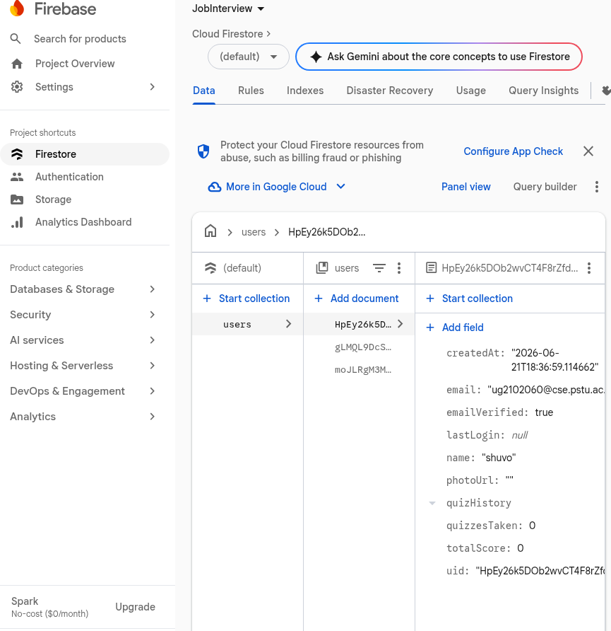
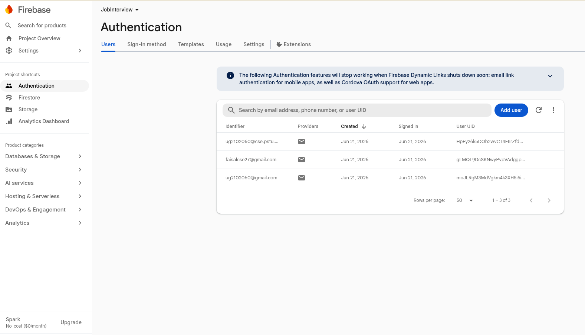

## Authentication (Firebase)
This project integrates Firebase Authentication to provide secure, production-oriented email/password authentication flows alongside Cloud Firestore for basic user profile storage.

Key authentication responsibilities:
- Sign-up (Registration): Implemented using `firebase_auth` (`createUserWithEmailAndPassword`). On successful registration the app creates a corresponding user document in Cloud Firestore and triggers an email verification to confirm ownership of the address.
- Sign-in (Login): Implemented using `firebase_auth` (`signInWithEmailAndPassword`). The application verifies the user's email verification status and enforces verification for access to protected areas when configured.
- Forgotten password: The password-reset flow uses `firebase_auth`'s `sendPasswordResetEmail` to deliver a reset link to the user's email.
- Email verification: Verification emails are sent using `sendEmailVerification`. The app refreshes the user state (or prompts re-login) to obtain updated verification status before granting elevated access.

Implementation notes:
- User metadata (e.g., display name, creation timestamp, minimal profile data) is stored in Cloud Firestore to support UI personalization and lightweight profile management.
- Authentication state and navigation are managed with GetX (`get` package) for concise controllers and reactive UI updates.
- All Firebase initialization is performed with `firebase_core`; the generated `firebase_options.dart` contains per-platform configuration produced by the FlutterFire CLI.

Required packages (as declared in `pubspec.yaml`):
- `firebase_core` — Firebase initialization
- `firebase_auth` — Authentication APIs (sign-up, sign-in, password reset, email verification)
- `cloud_firestore` — Persistent user profile storage
- `get` — State management and routing
- UI/utility packages: `lottie`, `flutter_animate`, `shimmer`, `google_fonts`, `font_awesome_flutter`, `iconsax`, `flutter_svg`, `cupertino_icons`

Firebase setup checklist:
1. Ensure `firebase_options.dart` exists in `lib/` (generated by FlutterFire). If not, run the FlutterFire CLI to configure your project:

```bash
dart pub global activate flutterfire_cli
flutterfire configure
```

2. Add platform config files when required:
- Android: place `google-services.json` in `android/app/`.
- iOS: place `GoogleService-Info.plist` in `ios/Runner/` and add to Xcode project.

3. Run the app and test authentication flows locally with a debug device or emulator.

Security & production notes:
- Consider enabling Firebase Authentication reCAPTCHA, email link sign-in, or multi-factor authentication for additional protection in production scenarios.
- Restrict Firestore rules to enforce that users can only access their own documents.

## Project UI

<p align="center">
	
	&nbsp;&nbsp;&nbsp;
	
	&nbsp;&nbsp;&nbsp;
	
	&nbsp;&nbsp;&nbsp;
	
	&nbsp;&nbsp;&nbsp;
	
	&nbsp;&nbsp;&nbsp;
	
	&nbsp;&nbsp;&nbsp;
	
	&nbsp;&nbsp;&nbsp;
	

  
</p>

## Getting started
Prerequisites: Flutter SDK (stable), and a development platform (Android, iOS, Linux, macOS, or web).

1. Install dependencies:

```bash
flutter pub get
```

2. Run the app on a connected device or emulator:

```bash
flutter run
```


2. Add those packages to the pubspec.yaml file :

```bash
 -  google_fonts: ^8.1.0
 - font_awesome_flutter: ^11.0.0
 - lottie: ^3.3.3
```

## Project structure (important files)
- `lib/main.dart` — App entry point
- `lib/screens/homescreen.dart` — Home and navigation
- `lib/screens/quiz_screen.dart` — Quiz UI and logic
- `lib/screens/success_Screen.dart` — Results screen
- `lib/data/question_repository.dart` — Question source and repository
- `lib/models/question_model.dart` — Question model


## Contributing
Feel free to open issues or pull requests. Keep changes focused and include simple tests or screenshots when relevant.

## License
This project is provided as-is. Add a license file if you want to define reuse terms.